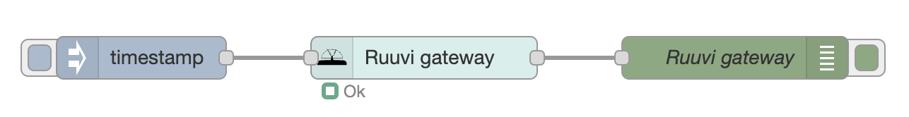

# Ruuvi gateway node

The node uses the [poll mode](https://docs.ruuvi.com/gw-examples/polling-mode) to retrieve
the values from the [Ruuvi Gateway](https://ruuvi.com/gateway/) and gets triggered when receiving input.

### Inputs

- `payload (string|number|json)` : the trigger to poll the Ruuvi gateway

The `msg.topic` is filled with the MAC address of the queried gateway.

### Outputs

- `payload (json)` : the answer from the Ruuvi gateway

A typical answer contains a few top level fields:

- `timestamp` : the timestamp of the retrieval
- `tags` : an object, containing all of the tags that are within reach of the gateway
- `gw_mac` : the MAC address of the queried gateway 

The `tags` contain an object for each found Ruuvi sensor, identified by its id. Typical fields that reside within this object are:
- `rssi` : the signal strenght
- `timestamp` : timestamp of the last received sensor reading
- `data` : raw field containing the data of the sensor
- `dataFormat` : identifier for the data format
- `temperature` : the temperature in degrees Celsius
- `humidity` : the humidity in percentage
- `pressure` : if available, the pressure. Seems to return `null` 
- `axelX` ,`axelY` and `axelZ` - movement information
- `movementCounter` - how often the sensor was moved
- `voltage` - the battery voltage
- `txPower` - the transmit txPower
- `measurementSequenceNumber` - a sequence number
- `id` - the identification id for the sensor

### Configuration

- `name (string)` : the name for the node
- `gateway (ruuvi config)` : the configured Ruuvi gateway
- `store in global context (boolean)` : whether or not to store the answer in the global context
- `verbose (boolean)` : show the used curl command in the debug tab

Configure the gateway to enable [poll mode](https://docs.ruuvi.com/gw-examples/polling-mode).
Then copy and paste the token into the configuration of a new Ruuvi gateway.

Also fill out the hostname or ip address for the Ruuvi gateway. The easiest way is to
enter `ruuvigatewayXXXX.local`, where the `XXXX` match the code, which is printed on the
backside of the Ruuvi gateway.
